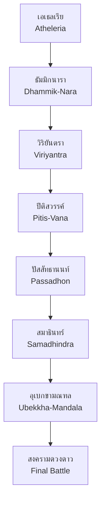

# โลกเกม Cosmic Narrative

## 🏛️ เมืองหลักทั้ง 7 (Seven Hubs)

เมืองหลักทั้ง 7 ในเกม Cosmic Narrative Game ได้รับแรงบันดาลใจจากหลักธรรม **โพชฌงค์ 7** (Seven Factors of Enlightenment) และสถานที่จริงในประเทศไทย

### 1. เอเธลเรีย (Atheleria)
**หลักธรรม**: สติ (Awareness)  
**สถานที่จริง**: วัดอรุณราชวราราม / วัดเบญจมบพิตร  
**สี**: ขาว-เทาอ่อน

!!! info "คำอธิบาย"
    เมืองสีขาวมุกประดับกระจกสะท้อนแสงดาว เป็นจุดเริ่มต้นที่ผู้เล่นต้อง 'ตื่นรู้' และเริ่มต้นการผจญภัย

---

### 2. ธัมมิกนารา (Dhammik-Nara)
**หลักธรรม**: ธัมมวิจยะ (Investigation)  
**สถานที่จริง**: อุทยานประวัติศาสตร์สุโขทัย  
**สี**: เหลืองอำพัน-ส้มอ่อน

!!! info "คำอธิบาย"
    เมืองแห่งห้องสมุดศิลาลอยฟ้า ที่ซึ่งความรู้จากอดีตถูกเก็บรักษาไว้ในรูปของแสง ผู้เล่นจะได้ค้นคว้าและเรียนรู้ประวัติศาสตร์ของโลก

---

### 3. วิริยันตรา (Viriyantra)
**หลักธรรม**: วิริยะ (Energy)  
**สถานที่จริง**: ปราสาทหินพนมรุ้ง  
**สี**: แดงอ่อน-ส้ม

!!! info "คำอธิบาย"
    เมืองบนยอดภูเขาไฟเก่าที่ดับแล้ว บรรยากาศร้อนแรง ต้องใช้ความพยายามและพลังงานในการปีนป่ายและผ่านด่านต่างๆ

---

### 4. ปีติสวรรค์ (Pitis-Vana)
**หลักธรรม**: ปีติ (Joy)  
**สถานที่จริง**: ทะเลอันดามัน / สระมรกต  
**สี**: เขียวมรกต-เทอควอยซ์

!!! info "คำอธิบาย"
    เมืองกึ่งนฤมิตที่มีพืชพรรณเรืองแสงและสายน้ำศักดิ์สิทธิ์ สื่อถึงความสุขและความงดงามของธรรมชาติ

---

### 5. ปัสสัทธานนท์ (Passadhon)
**หลักธรรม**: ปัสสัทธิ (Tranquillity)  
**สถานที่จริง**: ป่าสน จังหวัดแพร่ / น่าน  
**สี**: ฟ้าอ่อน-น้ำเงินอ่อน

!!! info "คำอธิบาย"
    เมืองท่ามกลางขุนเขาที่มีเสียงระฆังลมดังตลอดเวลา เป็นที่พักฟื้นจิตวิญญาณและสร้างความสงบให้กับผู้เล่น

---

### 6. สมาธินทร์ (Samadhindra)
**หลักธรรม**: สมาธิ (Concentration)  
**สถานที่จริง**: พระปฐมเจดีย์  
**สี**: ม่วงอินดิโก-ไวโอเล็ต

!!! info "คำอธิบาย"
    โครงสร้างเมืองทรงกลมที่หมุนรอบแกนกลางเพียงจุดเดียว ทุกอย่างนิ่งสงบ ต้องใช้สมาธิในการผ่านด่าน

---

### 7. อุเบกขามณฑล (Ubekkha-Mandala)
**หลักธรรม**: อุเบกขา (Equanimity)  
**สถานที่จริง**: ยอดดอยอินทนนท์  
**สี**: ชมพูม่วง-ม่วงอ่อน

!!! info "คำอธิบาย"
    วิหารเหนือเมฆที่มองเห็นทุกมหานครเบื้องล่าง สื่อถึงการปล่อยวางและการหลุดพ้น เป็นเมืองสุดท้ายก่อนการต่อสู้ครั้งยิ่งใหญ่

---

## 🗺️ แผนที่โลก

## 🌟 ธีมและแนวคิด

เกม Cosmic Narrative Game ผสมผสาน:

- **พุทธศาสนา**: โพชฌงค์ 7, ราศี 12, แนวคิดเรื่องกรรมและการหลุดพ้น
- **วัฒนธรรมไทย**: สถานที่จริงในประเทศไทย, สถาปัตยกรรม, ตำนาน
- **ดาราศาสตร์**: ดวงดาว, กาแล็กซี, พลังแห่งจักรวาล
- **จิตวิทยา**: การเติบโตของตัวละคร, การเผชิญหน้ากับตนเอง
