# โลกเกม Cosmic Narrative

## 🏛️ เมืองหลักทั้ง 7 (Seven Hubs)

เมืองหลักทั้ง 7 ในเกม Cosmic Narrative Game ได้รับแรงบันดาลใจจากหลักธรรม **โพชฌงค์ 7** (Seven Factors of Enlightenment) และสถานที่จริงในประเทศไทย

### 1. เอเธลเรีย (Atheleria)
**หลักธรรม**: สติ (Awareness)  
**สถานที่จริง**: วัดอรุณราชวราราม / วัดเบญจมบพิตร  
**สี**: <span style="background: linear-gradient(to right, #f1f5f9, #ffffff); padding: 4px 12px; border-radius: 4px;">ขาว-เทาอ่อน</span>

!!! info "คำอธิบาย"
    เมืองสีขาวมุกประดับกระจกสะท้อนแสงดาว เป็นจุดเริ่มต้นที่ผู้เล่นต้อง 'ตื่นรู้' และเริ่มต้นการผจญภัย

> **Prompt:**

```prompt
A breathtaking cosmic city made of white pearl and reflective starlight glass. The architecture is inspired by traditional Thai temples like Wat Arun and Wat Benchamabophit, but with a futuristic, sci-fi cosmic twist. Floating spires, celestial nebulas in the background, sacred white-grey color palette. Cinematic lighting, ethereal atmosphere, 8k resolution. Premium and majestic.
```


---

### 2. ธัมมิกนารา (Dhammik-Nara)
**หลักธรรม**: ธัมมวิจยะ (Investigation)  
**สถานที่จริง**: อุทยานประวัติศาสตร์สุโขทัย  
**สี**: <span style="background: linear-gradient(to right, #fef3c7, #ffedd5); padding: 4px 12px; border-radius: 4px;">เหลืองอำพัน-ส้มอ่อน</span>

!!! info "คำอธิบาย"
    เมืองแห่งห้องสมุดศิลาลอยฟ้า ที่ซึ่งความรู้จากอดีตถูกเก็บรักษาไว้ในรูปของแสง ผู้เล่นจะได้ค้นคว้าและเรียนรู้ประวัติศาสตร์ของโลก

> **Prompt:**

```prompt
A majestic floating city of ancient stone libraries and floating monoliths suspended in a golden amber atmosphere. The architecture is heavily inspired by Sukhothai Historical Park (Thailand), featuring ruined stupas and structures integrated with glowing cosmic energy circuits. Warm amber and golden-orange lighting. Celestial scrolls and light-based data floating in the air. 8k resolution, cinematic, grand and scholarly vibe. Premium design.
```


---

### 3. วิริยันตรา (Viriyantra)
**หลักธรรม**: วิริยะ (Energy)  
**สถานที่จริง**: ปราสาทหินพนมรุ้ง  
**สี**: <span style="background: linear-gradient(to right, #fee2e2, #fed7aa); padding: 4px 12px; border-radius: 4px;">แดงอ่อน-ส้ม</span>

!!! info "คำอธิบาย"
    เมืองบนยอดภูเขาไฟเก่าที่ดับแล้ว บรรยากาศร้อนแรง ต้องใช้ความพยายามและพลังงานในการปีนป่ายและผ่านด่านต่างๆ

> **Prompt:**

```prompt
A grand volcanic city built upon an extinct volcano's caldera. The architecture is inspired by the Khmer-style sandstone of Phanom Rung Historical Park (Thailand). Massive stone pillars and staircases, glowing contained lava rivers, and intense orange and red atmospheric lighting. Fire-based cosmic power radiating from central temples. Dramatic, volcanic, powerful energy theme. 8k resolution, cinematic, epic scale. Premium design.
```


---

### 4. ปีติสวรรค์ (Pitis-Vana)
**หลักธรรม**: ปีติ (Joy)  
**สถานที่จริง**: ทะเลอันดามัน / สระมรกต  
**สี**: <span style="background: linear-gradient(to right, #d1fae5, #ccfbf1); padding: 4px 12px; border-radius: 4px;">เขียวมรกต-เทอควอยซ์</span>

!!! info "คำอธิบาย"
    เมืองกึ่งนฤมิตที่มีพืชพรรณเรืองแสงและสายน้ำศักดิ์สิทธิ์ สื่อถึงความสุขและความงดงามของธรรมชาติ

> **Prompt:**

```prompt
An enchanting city in a semi-aquatic paradise of bioluminescent flora and crystal-clear holy waters. The aesthetic is inspired by the Andaman Sea and the Emerald Pool of Thailand. Elegant structures, pavilions, giant glowing lotus flowers, and waterfalls of turquoise liquid light. Emerald-turquoise color palette. Peaceful, joyful, and magical atmosphere with floating light particles. 8k resolution, cinematic, premium fantasy style.
```


---

### 5. ปัสสัทธานนท์ (Passadhon)
**หลักธรรม**: ปัสสัทธิ (Tranquillity)  
**สถานที่จริง**: ป่าสน จังหวัดแพร่ / น่าน  
**สี**: <span style="background: linear-gradient(to right, #cffafe, #e0f2fe); padding: 4px 12px; border-radius: 4px;">ฟ้าอ่อน-น้ำเงินอ่อน</span>

!!! info "คำอธิบาย"
    เมืองท่ามกลางขุนเขาที่มีเสียงระฆังลมดังตลอดเวลา เป็นที่พักฟื้นจิตวิญญาณและสร้างความสงบให้กับผู้เล่น

> **Prompt:**

```prompt
A serene mountain city nestled within a dense forest of giant glowing pine trees. The architecture is inspired by Northern Thai (Lanna) styles with tiered roofs, perched on cliff edges. Mist and fog roll through the valley, glowing with a soft light blue hue. Wind chimes of celestial crystal hang from every corner. Tranquil, silent, and spiritual atmosphere with soft light beams. 8k resolution, cinematic, premium mountain-retreat vibe.
```


---

### 6. สมาธินทร์ (Samadhindra)
**หลักธรรม**: สมาธิ (Concentration)  
**สถานที่จริง**: พระปฐมเจดีย์  
**สี**: <span style="background: linear-gradient(to right, #e0e7ff, #ede9fe); padding: 4px 12px; border-radius: 4px;">ม่วงอินดิโก-ไวโอเล็ต</span>

!!! info "คำอธิบาย"
    โครงสร้างเมืองทรงกลมที่หมุนรอบแกนกลางเพียงจุดเดียว ทุกอย่างนิ่งสงบ ต้องใช้สมาธิในการผ่านด่าน

> **Prompt:**

```prompt
A concentric city of floating rings rotating around a central massive golden pagoda resembling Phra Pathom Chedi, but with sci-fi energy emitters. The architecture is a mix of pure white marble and deep indigo energy lines. Concentric geometric patterns everywhere, perfectly symmetrical. Deep indigo and violet starlight theme. Concentration-themed meditative atmosphere. 8k resolution, cinematic, premium.
```


---

### 7. อุเบกขามณฑล (Ubekkha-Mandala)
**หลักธรรม**: อุเบกขา (Equanimity)  
**สถานที่จริง**: ยอดดอยอินทนนท์  
**สี**: <span style="background: linear-gradient(to right, #fae8ff, #f3e8ff); padding: 4px 12px; border-radius: 4px;">ชมพูม่วง-ม่วงอ่อน</span>

!!! info "คำอธิบาย"
    วิหารเหนือเมฆที่มองเห็นทุกมหานครเบื้องล่าง สื่อถึงการปล่อยวางและการหลุดพ้น เป็นเมืองสุดท้ายก่อนการต่อสู้ครั้งยิ่งใหญ่

> **Prompt:**

```prompt
A divine celestial palace floating far above the sea of eternal clouds, overlooking the infinite cosmos. The architecture is a grand crystalline mandala structure, shimmering with ethereal pink, lavender, and soft violet starlight. Inspired by the majestic peaks of Doi Inthanon (Thailand) but reimagined as a state-of-the-art sci-fi temple of pure light. Peaceful pink-purple nebulas in the background, cosmic aurora borealis, divine and serene atmosphere. Cinematic lighting, 8k resolution, ultra-detailed premium design, spiritual finality theme.
```

    

---

## 🗺️ แผนที่โลก

```mermaid
graph TD
    A[เอเธลเรีย<br/>Atheleria] --> B[ธัมมิกนารา<br/>Dhammik-Nara]
    B --> C[วิริยันตรา<br/>Viriyantra]
    C --> D[ปีติสวรรค์<br/>Pitis-Vana]
    D --> E[ปัสสัทธานนท์<br/>Passadhon]
    E --> F[สมาธินทร์<br/>Samadhindra]
    F --> G[อุเบกขามณฑล<br/>Ubekkha-Mandala]
    G --> H[สงครามดวงดาว<br/>Final Battle]
```



## 🌟 ธีมและแนวคิด

เกม Cosmic Narrative Game ผสมผสาน:

- **พุทธศาสนา**: โพชฌงค์ 7, ราศี 12, แนวคิดเรื่องกรรมและการหลุดพ้น
- **วัฒนธรรมไทย**: สถานที่จริงในประเทศไทย, สถาปัตยกรรม, ตำนาน
- **ดาราศาสตร์**: ดวงดาว, กาแล็กซี, พลังแห่งจักรวาล
- **จิตวิทยา**: การเติบโตของตัวละคร, การเผชิญหน้ากับตนเอง
