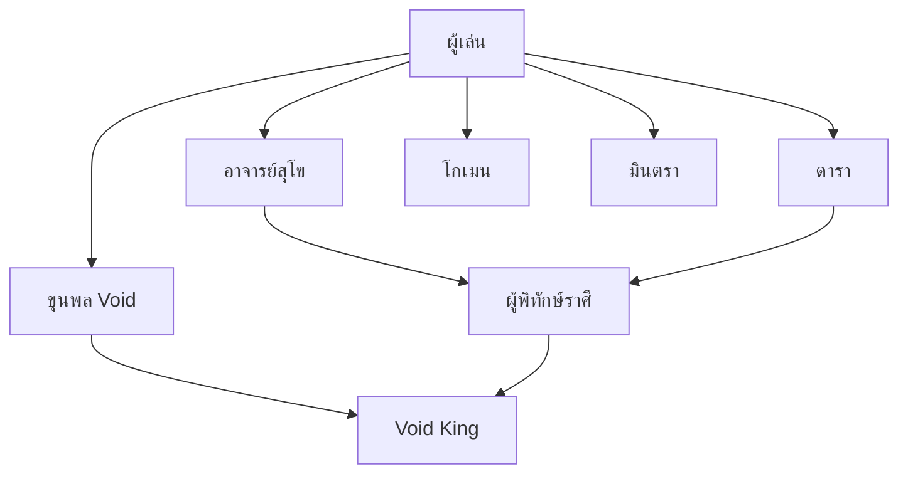

# ตัวละครใน Cosmic Narrative Game

## 🎮 ตัวละครที่เล่นได้ (Playable Characters)

### ☀️ อัคนี (Agni) - Solar Warrior
**วิถี**: สุริยัน (Solar Path)  
**สไตล์**: นักรบพละกำลัง  
**ธาตุ**: ไฟ ⚡

!!! tip "จุดเด่น"
    - โจมตีแรงสูง
    - ทนทานต่อความเสียหายทางกายภาพ
    - สกิลพิเศษ: Solar Flare (ระเบิดพลังสุริยัน)

**เรื่องราว**: นักรบผู้ได้รับพรจากดวงอาทิตย์ มีหน้าที่ปกป้องแสงสว่างจากความมืด

---

### 🌙 จันทรา (Chandra) - Lunar Mage
**วิถี**: จันทรา (Lunar Path)  
**สไตล์**: นักเวทย์  
**ธาตุ**: น้ำ 💧

!!! tip "จุดเด่น"
    - เวทมนตร์ทรงพลัง
    - สามารถรักษาและสนับสนุนพันธมิตร
    - สกิลพิเศษ: Lunar Tide (คลื่นพลังจันทรา)

**เรื่องราว**: นักเวทย์ผู้สื่อสารกับดวงจันทร์ ใช้พลังแห่งความลึกลับและการเปลี่ยนแปลง

---

### 🌪️ วายุ (Vayu) - Astral Archer
**วิถี**: วายุ (Wind Path)  
**สไตล์**: นักธนูความเร็วสูง  
**ธาตุ**: ลม 💨

!!! tip "จุดเด่น"
    - ความเร็วและความคล่องแคล่วสูงสุด
    - โจมตีระยะไกล
    - สกิลพิเศษ: Astral Arrow (ลูกศรดาวฤกษ์)

**เรื่องราว**: นักธนูผู้รวดเร็วดั่งสายลม สามารถยิงธนูที่ทำจากแสงดาวได้

---

### 🛡️ ปฐพี (Pathapi) - Earth Guardian
**วิถี**: ธรณี (Earth Path)  
**สไตล์**: ผู้พิทักษ์  
**ธาตุ**: ดิน 🪨

!!! tip "จุดเด่น"
    - ป้องกันสูงที่สุด
    - ปกป้องพันธมิตร
    - สกิลพิเศษ: Earth Shield (โล่ธรณี)

**เรื่องราว**: ผู้พิทักษ์ผู้มั่นคงดั่งภูเขา มีหน้าที่ปกป้องผู้อ่อนแอและรักษาสมดุล

---

## 🤝 ตัวละครสนับสนุน (Support Characters)

### 📖 อาจารย์สุโข
**บทบาท**: Mentor (ครูผู้สอน)  
**ตำแหน่ง**: ผู้พิทักษ์วิหาร

!!! info "เกี่ยวกับ"
    อาจารย์ผู้เฒ่าผู้ชี้นำทางให้กับผู้เล่น เป็นผู้รู้ความลับของศิลา 12 ราศีและประวัติศาสตร์ของโลก

**คำพูดเด่น**: *"แสงสว่างไม่ได้มาจากภายนอก แต่มาจากภายในจิตใจของเจ้า"*

---

### 🧭 ดารา (Dara)
**บทบาท**: Guide (ผู้นำทาง)  
**ตำแหน่ง**: เด็กวัดผู้ร่าเริง

!!! info "เกี่ยวกับ"
    เด็กน้อยผู้ร่าเริงที่จะคอยนำทางและให้กำลังใจผู้เล่นตลอดการเดินทาง มีความสามารถพิเศษในการสื่อสารกับดวงดาว

**คำพูดเด่น**: *"อย่ากลัวเลย! ดาวทุกดวงจะคอยส่องทางให้เรา"*

---

### 🔨 โกเมน
**บทบาท**: Blacksmith (ช่างตีเหล็ก)  
**ตำแหน่ง**: นายช่างผู้เชี่ยวชาญ

!!! info "เกี่ยวกับ"
    ช่างตีเหล็กผู้มีฝีมือสูง สามารถสร้างและอัพเกรดอาวุธ เกราะ และไอเทมพิเศษให้กับผู้เล่น

**บริการ**:
- ⚔️ สร้างอาวุธ
- 🛡️ อัพเกรดเกราะ
- 💎 ฝังอัญมณี

---

### 🌿 มินตรา
**บทบาท**: Healer (หมอรักษา)  
**ตำแหน่ง**: ผู้สื่อสารวิญญาณป่า

!!! info "เกี่ยวกับ"
    หมอรักษาผู้มีความสามารถในการสื่อสารกับวิญญาณของธรรมชาติ สามารถรักษาบาดแผลและขจัดคำสาปได้

**บริการ**:
- ❤️ ฟื้นฟู HP
- 💙 ฟื้นฟู MP
- ✨ ขจัดสถานะผิดปกติ

---

## 👑 ผู้พิทักษ์ราศี (Zodiac Guardians)

### ⚡ เมฆา (Aries) - ผู้พิทักษ์แห่งความกล้า
**ราศี**: เมษ (Aries)  
**คุณสมบัติ**: ความกล้าหาญ, การเป็นผู้นำ

!!! quote "บททดสอบ"
    "ความกล้าไม่ใช่การไร้ความกลัว แต่คือการเผชิญหน้ากับความกลัวนั้น"

---

### 🪨 นันทิ (Taurus) - ผู้พิทักษ์แห่งความมั่งคั่ง
**ราศี**: พฤษภ (Taurus)  
**คุณสมบัติ**: ความมั่นคง, ความอดทน

!!! quote "บททดสอบ"
    "ความมั่งคั่งที่แท้จริงคือการแบ่งปัน ไม่ใช่การสะสม"

---

### 👑 สีหราช (Leo) - ราชาแห่งเกียรติยศ
**ราศี**: สิงห์ (Leo)  
**คุณสมบัติ**: ศักดิ์ศรี, ความเป็นผู้นำ

!!! quote "บททดสอบ"
    "ผู้นำที่แท้จริงคือผู้ที่รับใช้ผู้อื่น ไม่ใช่ผู้ที่ใช้ผู้อื่น"

---

### 💧 มีนา (Pisces) - ผู้ปล่อยวางแห่งท้องทะเล
**ราศี**: มีน (Pisces)  
**คุณสมบัติ**: ความเมตตา, การปล่อยวาง

!!! quote "บททดสอบ"
    "การปล่อยวางคือการยอมรับ ไม่ใช่การละทิ้ง"

---

## 😈 ศัตรู - ขุนพลแห่ง Void

### 👁️ โมหะ (Moha) - ขุนพลแห่งความหลงผิด
**กิเลส**: โมหะ (Delusion)  
**พลัง**: สร้างภาพลวงตาและความสับสน

!!! danger "ภัยคุกคาม"
    สามารถทำให้ผู้เล่นเห็นภาพหลอนและสับสนระหว่างความจริงกับมายา

---

### 🔥 โทสะ (Tosa) - ขุนพลแห่งความโกรธา
**กิเลส**: โทสะ (Anger)  
**พลัง**: พลังทำลายล้างด้วยความโกรธ

!!! danger "ภัยคุกคาม"
    โจมตีด้วยพลังไฟแห่งความโกรธที่สามารถเผาผลาญทุกสิ่ง

---

### 💰 โลภะ (Lobha) - ขุนพลแห่งความโลภ
**กิเลส**: โลภะ (Greed)  
**พลัง**: ดูดกลืนพลังและทรัพยากร

!!! danger "ภัยคุกคาม"
    สามารถดูดพลังชีวิตและมานาของผู้เล่น ทำให้อ่อนแอลง

---

### 💀 Void King - ราชาแห่งความว่างเปล่า
**บทบาท**: Boss สุดท้าย  
**พลัง**: การควบคุมความว่างเปล่าและการทำลายล้าง

!!! danger "ภัยคุกคาม"
    ศัตรูที่แข็งแกร่งที่สุด ต้องการทำลายดวงดาวทั้งหมดและนำความว่างเปล่ามาสู่จักรวาล

**เฟส**:
1. **เฟส 1**: ใช้พลังกิเลสทั้ง 3 (โมหะ, โทสะ, โลภะ)
2. **เฟส 2**: เปลี่ยนร่างเป็น True Form
3. **เฟส 3**: การต่อสู้ครั้งสุดท้ายในมิติแห่งดวงดาว

---

## 🎭 ความสัมพันธ์ระหว่างตัวละคร

## 💡 เคล็ดลับ

!!! tip "การเลือกตัวละคร"
    - **มือใหม่**: แนะนำ **ปฐพี** (Earth Guardian) เพราะมีความทนทานสูง
    - **ชอบโจมตี**: เลือก **อัคนี** (Solar Warrior)
    - **ชอบเวทย์**: เลือก **จันทรา** (Lunar Mage)
    - **ชอบความเร็ว**: เลือก **วายุ** (Astral Archer)

!!! tip "การสร้างความสัมพันธ์"
    พูดคุยกับ NPC บ่อยๆ จะได้รับ:
    - 🎁 ไอเทมพิเศษ
    - 📚 ข้อมูลลับ
    - 💪 บัฟพิเศษ
    - 🌟 เควสไซด์
